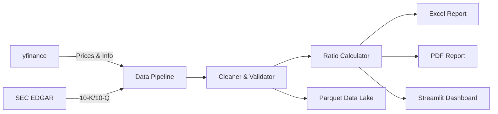

# 📊 Curator Finance — Intelligent Financial Intelligence Platform


**Curator Finance** is a professional-grade, dual-purpose financial analysis platform. It seamlessly bridges the gap between high-performance **Automation Pipelines** (CLI-based reporting) and high-fidelity **Interactive Dashboards** (Web-based research), featuring a premium glassmorphic dark-navy aesthetic.

---

## 🚀 Key Features

### 🛠️ Professional Automation Pipeline (`main.py`)
Transform raw ticker symbols into investment-banking-grade models with a single command.
- **Precision Data Ingestion**: Seamlessly fetches audited 10-K/10-Q fundamentals from the **SEC EDGAR** database and live real-time market data from **Yahoo Finance**.
- **Financial Engineering Engine**: 
    - **Advanced Ratios**: Computes over **25+ key performance indicators** including Profitability, Liquidity, Solvency, and Efficiency metrics.
    - **DuPont Analysis**: Built-in 3-factor decomposition to break down Return on Equity (ROE) into Asset Turnover, Financial Leverage, and Profit Margin.
    - **Growth Tracks**: Automated year-over-year (YoY) variance analysis for Revenue, EBITDA, and Net Income.
- **Intelligence Persistence**: Implements a high-performance **Parquet-based Data Lake** for type-safe, compressed, and fast I/O storage of processed financials.
- **Enterprise Reporting**:
    - **Excel Models**: Generates professionally formatted workbooks with conditional formatting, IB-style navy headers, and auto-adjusting column widths.
    - **PDF Summaries**: Automated generation of aesthetic PDF research notes with embedded data tables and cover pages.

### 🏛️ Interactive "Curator" Dashboard (`app.py`)
A state-of-the-art web interface designed for deep-dive equity research and visualization.
- **Modern UI Architecture**: Custom-injected CSS providing a "Curator" design system—featuring glassmorphic dark-navy themes, smooth micro-animations, and high-visibility slate-background KPI cards.
- **Three-Statement Analysis**: Interactive multi-year views of **Income Statements**, **Balance Sheets**, and **Cash Flow Statements** with intelligent "Millions/Billions" auto-scaling.
- **Visual Intelligence**: Response-ready line and bar charts powered by **Plotly**, tracking everything from revenue segmentation to historical price-to-earnings (P/E) trends.
- **Research Modules**:
    - **Technical Trends**: Integrated candlestick charts, volume analysis, and 52-week range monitoring.
    - **Valuation Workbench**: Built-in **Discounted Cash Flow (DCF)** engines with adjustable sensitivity parameters.
    - **Corporate Insights**: Automated tracking of corporate actions, stock splits, and institutional ownership breakdown.

---

## 🏗️ Architecture & Tech Stack



| Component | Technology | Purpose |
|-----------|-----------|---------|
| **Core** | Python 3.11+ | Orchestration & Logic |
| **Dashboard** | Streamlit + Plotly | Reactive UI & Visualization |
| **Data Engine** | Pandas + NumPy | High-speed processing |
| **Persistence** | Apache Parquet | Type-safe, compressed storage |
| **Reporting** | OpenPyXL + FPDF2 | Professional XLSX/PDF output |

---

## ⚙️ Quick Start

### 1. Installation
```bash
# Clone the repository
git clone https://github.com/insomniumroxcs-source/financial-reporting-system.git
cd financial-reporting-system

# Install dependencies
pip install -r requirements.txt
```

### 2. Launch the Dashboard (UI)
```bash
streamlit run src/dashboard/app.py
```

### 3. Run the Automation Pipeline (CLI)
```bash
# Generate reports for specific tickers
python main.py --tickers AAPL MSFT NVDA --output-dir ./output
```

---

## 📂 Project Structure

- `src/`: Core Python source code (Ingestion, Processing, Reporting).
- `src/dashboard/`: Streamlit orchestrator, CSS assets, and modular tab logic.
- `data/`: Parquet data lake for raw and processed financial statements.
- `output/`: Automated directory for generated Excel and PDF research reports.
- `assets/`: UI design tokens and branding assets.

---

<p align="center">
  <i>Created for High-Performance Financial Analysis & Professional Equity Research.</i><br>
  <b>FMVA Certified | CFA Candidate | IIM Kozhikode</b>
</p>
