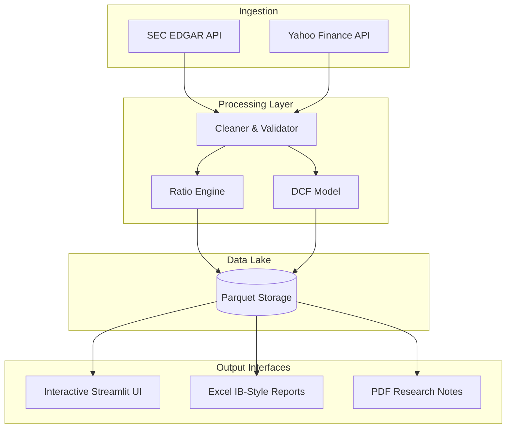

# 🏦 Curator Finance: Professional Financial Intelligence Platform
## A Case Study in Automated Equity Research & High-Fidelity Visualization

### 🌟 Executive Summary
**Curator Finance** is an end-to-end investment research platform designed to automate the heavy lifting of financial analysis. It bridges the gap between raw regulatory data and actionable investment insights by combining a robust **Data Engineering Pipeline** with a premium **Streamlit Dashboard**.

Built for analysts and investors who demand precision, the platform transforms ticker symbols into comprehensive financial models, Excel workbooks, and interactive visualizations in seconds.

---

### 🚀 Core Value Proposition

#### 1. Zero-Friction Data Ingestion
- **SEC EDGAR Integration**: Automated fetching of audited 10-K and 10-Q filings, bypassing manual CSV exports.
- **Market Dynamics**: Real-time pricing, company metadata, and institutional ownership via Yahoo Finance.
- **Unified Schema**: Standardizes inconsistent XBRL tags into a high-performance **Parquet Data Lake**.

#### 2. Automated Financial Engineering
- **25+ Critical Metrics**: Instant calculation of Profitability, Liquidity, Solvency, and Growth ratios.
- **DuPont Analysis**: 3-factor decomposition of Retun on Equity (ROE) to identify exact drivers of corporate performance.
- **Valuation Workbench**: Built-in **Discounted Cash Flow (DCF)** engines with sensitivity analysis.

#### 3. Premium Interactive Experience
- **"Curator" Design System**: A bespoke dark-navy aesthetic featuring glassmorphism, micro-animations, and high-visibility data tiles.
- **Multi-Tab Research**: Modular views for Fundamentals, Technicals, Peer Comparison, and Variance Tracking.

---

### 🏗️ Technical Architecture



- **Languages**: Python 3.11+
- **Frontend**: Streamlit, Plotly (Custom CSS Injection)
- **Data Science**: Pandas, NumPy, Scipy
- **Reporting**: OpenPyXL, FPDF2
- **Persistence**: Apache Parquet

---

### 📋 Key Modules

| Module | Description | Capability |
| :--- | :--- | :--- |
| **Automation Pipeline** | `main.py` | Full CLI-based report generation (XLSX/PDF) |
| **Curator UI** | `app.py` | Premium dark-mode interactive research dashboard |
| **DCF Engine** | `dcf_engine.py` | Automated 5-year free cash flow projections |
| **Ratio Calculator** | `calculator.py` | Complex financial logic including DuPont and TTM scaling |

---

### 🛠️ Professional Showcase Setup

#### **Installation**
```bash
git clone https://github.com/insomniumroxcs-source/financial-reporting-system.git
cd financial-reporting-system
pip install -r requirements.txt
```

#### **Deployment**
- **Streamlit Cloud**: Fully compatible with one-click deployment via GitHub.
- **CLI Mode**: Run `python main.py --tickers AAPL` for instant PDF/Excel generation.

---

### 🎓 Academic & Professional Context
*Developed as a bridge between quantitative finance and software engineering, incorporating best practices from CFA and FMVA methodologies.*

**Author**: FMVA Certified | CFA Candidate | IIM Kozhikode Alumni
**Repository**: [View on GitHub](https://github.com/insomniumroxcs-source/financial-reporting-system)

---
*Created for High-Performance Financial Analysis.*
